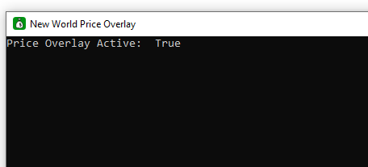

# New World Price Overlay

### Overview:
This add-on reads real time prices from https://nwmarketprices.com and displays an overlay in-game. It's using OpenCV and Tesseract to read the item name. I currently only have data for the Kshira Sagara server, but will be looking to expand to other servers soon.

**Video Demo**

### Disclaimer:
- This is very much a proof of concept and far from polished. There will be bugs and it likely won't work with some screen resolutions yet.
- Screen reading like this has not been directly addressed by AGS, and may violate their TOS. **CONSIDER YOURSELF WARNED** 
- Their [last statement](https://forums.newworld.com/t/dev-blog-update-on-current-issues-3/573313) on add-ons had this snippet: `an addon can reorganize or present the information normally displayed in a different way, or provide information that normally would require a different UI view to achieve.` This leads me to believe this overlay is ok, as I don't think it provides an advantage and the all this data is available from the Trading Post. But that is just my guess, you **use this software at your own risk**.

## Installation instructions:
1. Download Tesseract https://github.com/CommanderCashMoney/price_overlay/blob/master/final/tesseract5.exe
2. Install at C:\Program Files (x86)\Tesseract-OCR\tesseract and use all the default options. I've tried bundling tesseract into the install with vcpkg and pyinstall, but I'm having issues, if you can help head over to the [discord](https://discord.gg/fAaezEcH) and hit me up.
3. Download the overlay https://github.com/CommanderCashMoney/price_overlay/blob/master/dist/price_overlay.exe
4. You are going to get all kinds of warnings because this is an exe file and not digitally signed etc. If this makes you uncomfortable, you can copy the code and run it directly or package it up yourself. Or wait till I can put this in a cleaner msi package.
5. Run the price_overlay.exe, it may take 5-10 seconds to run the first time. 
6. You should see a command window open up press F6 and wait till you see this: 
7. Price overlay is now active and when it sees an inventory item should try to read the name and look up the price

### Usage:

- Mousing over an item should show the price.
- While over an item if you press alt+d it should open a browser tab to nwmarketprices.com to show you the details page
- When it can't read the name and shows you garbage, press ctrl+alt+c to copy that garbage name. Then if you could post it in the #item-name-cleanup channel of my [discord](https://discord.gg/fAaezEcH) with what it was trying to read. e.g 'LO7- sr-Je-9': 'Cabbage'
- Turn it off when you are not actually trying to view prices. Because it's reading the screen it does slightly affect your FPS. My FPS on a plain screen is around 100 and it drops to around 95 with the price overlay running

### My to do list:
This is the initial list of things I want to do next. If you think you can help with these let me know. If you have idea for other feature, put them in the #general chat of the discord.

https://github.com/CommanderCashMoney/price_overlay/issues/1

### Notes:
If you want to build it yourself I've included the spec file I used. As you can see it's hard coding the tesseract path because I had problems with vcpkg, it was only pulling Tesseract version 4.1 and it's much less accurate with that version.

